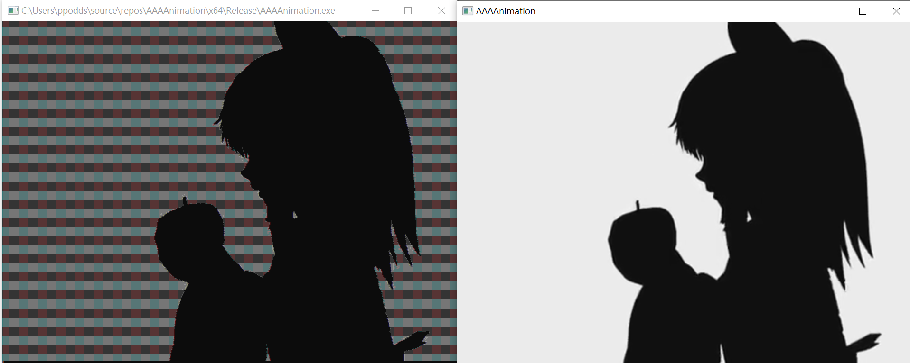
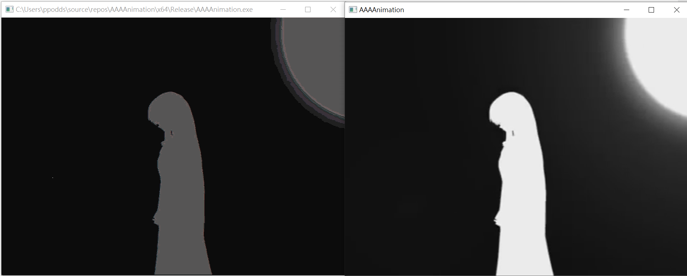

# AAAAnimation

## About

This is a term project of the Assembly Language and System Programming course in NCU. It decodes video with FFmpeg and plays ASCII animation with assembly. The graphic media player is implemented with Qt's QMediaPlayer and QVideoWidget.

## Screenshots






## Installation

### Use Prebuilt Binary

1. Install FFmpeg and add your ffmpeg bin to `PATH`
2. Download prebuilt binary from [here](https://github.com/ppodds/AAAAnimation/releases)

Caution:
Prebuilt binary conains Qt6's dependency, but you need to install FFmpeg by yourself.

### Compile From Source Code

#### Envirment

- Visual Studio 2019
  - Universal Windows Platform
  - C++ Desktop
  - Windows 10 SDK (10.0.1904)
  - Build Tools v142
  - Qt VS Tools (Extension)
- FFmpeg
  - [ffmpeg-n4.4.1-2-gcc33e73618-win64-lgpl-shared-4.4](https://github.com/BtbN/FFmpeg-Builds/releases)
- Qt
  - msvc 6.2.2
  - Windows

Caution:
you need to set Qt VS Tools's Qt Version to "Qt 6.2.2 for MSVC 2019"

#### Clone The Repository and Set Environment Variables

```shell
git clone https://github.com/ppodds/AAAAnimation.git
```

Environment Variables

- ffmpeg
  - `%your_project_path%\includes\ffmpeg`
- qt
  - `%your_qt_path%`
- PATH
  - `%qt%\bin;%ffmpeg%\bin%;...`

#### Build

Open `AAAAnimation.sln` and select build configuation (`Release`). Then build solution. You can see the result in `AAAAnimation\x64\Release\AAAAnimation.exe`.

If you want to deploy the binary, you can use qt's `windeployqt` tool in qt's console.

Change directory to `AAAAnimation\x64\Release` and run `windeployqt`

usage: `windeployqt AAAAnimation.exe`

This tool will copy dependencies to that folder and generate some files for deployment. Now you can run `AAAAnimation.exe` and enjoy it.

Caution:
`windeployqt` will not copy FFmpeg's dependencies to this folder. You need to copy them manually or add them to `PATH`.
